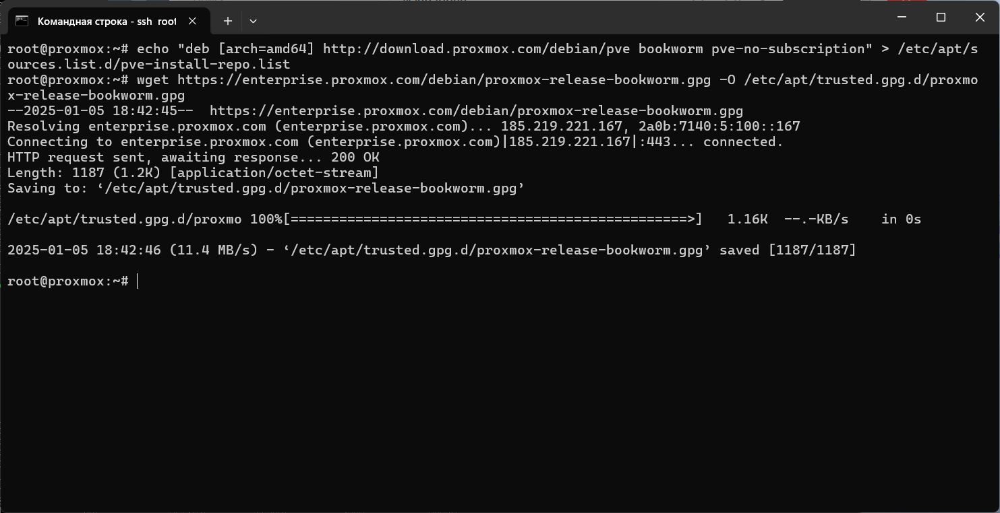

# Лабораторная работа №1

**Выполнил студент**: Ряднов Вениамин Сергеевич  

---

## Шаги выполнения работы

### 1. Установка VirtualBox и добавление машины
Скачали и установили VirtualBox, создали виртуальную машину.  

### 2. Подключение диска
Подключили диск с образом Debian 12.  

### 3. Запуск виртуальной машины
Запустили виртуальную машину.  

### 4. Проброс портов
Настроили проброс портов для SSH и веб-интерфейса Proxmox.  

### 5. Подключение по SSH
Подключились к виртуальной машине по SSH с использованием терминала.  

### 6. Установка Proxmox
Установили Proxmox на виртуальную машину.  

### 6.1. Перезагрузка системы
Перезагрузили систему после установки Proxmox.  

### 7. Проверка доступности Proxmox
Проверили доступность Proxmox с помощью команды ping.  

### 8. Запуск сервера Proxmox
Проверили запуск сервера Proxmox в терминале.  

### 9. Веб-интерфейс Proxmox
Открыли веб-интерфейс Proxmox и авторизовались с учетной записью root.  

---

## Вывод
Все шаги по установке и настройке Proxmox выполнены успешно. Веб-интерфейс доступен по адресу https://127.0.0.1:8006/. Логин и пароль — root.

