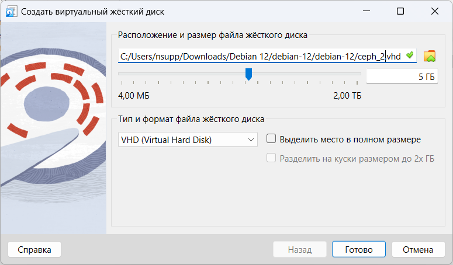
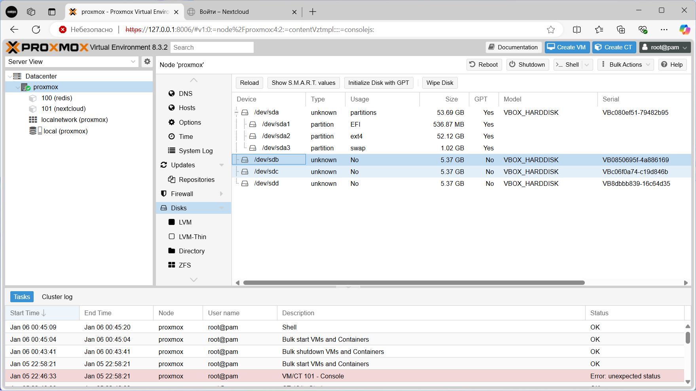

# Лабораторная работа №3

**Тема:** Proxmox + Ceph  
**Выполнил студент**: Ряднов Вениамин Сергеевич  

---

## Задача
Установить и настроить объектное хранилище Ceph для работы с Proxmox.

---

## Шаги выполнения работы

### 1. Добавление дополнительных дисков для Ceph
- Открыть VirtualBox.  
- Перейти в раздел **Настроить → Носители → Контроллеры SATA → Добавить Жесткий диск → Создать**.  
- Параметры дисков:
  - **Формат:** VHD.  
  - **Объем:** 5 Гб (или по возможностям устройства).  
  - **Имена:** ceph_1, ceph_2, ceph_3.  

**Скриншот 1:** Добавленные диски в VirtualBox.  

---

### 2. Проверка дисков в Proxmox
- Зайти в веб-интерфейс Proxmox.  
- Перейти на уровень ноды → **Disks**.  
- Убедиться, что новые диски отображаются (например, /dev/sdb, /dev/sdc, /dev/sdd).  

**Скриншот 2:** Список дисков в Proxmox.  

---

### 3. Установка Ceph
- Перейти в меню **Ceph**.  
- При появлении предложения об установке выбрать **Install Ceph**.  
- Выбрать репозиторий **No-subscription**.  
- В разделе **Configuration** указать используемую сеть.  

**Скриншот 3:** Процесс установки Ceph.  

---

### 4. Проверка статуса Ceph
- После установки Ceph откроется раздел с его состоянием.  
- На начальном этапе статус может быть **зеленый**, но затем сменится на **желтый** из-за отсутствия добавленных дисков (OSD).  

**Скриншот 4:** Начальный статус Ceph.  

---

### 5. Добавление дисков в Ceph (OSD)
- Перейти в меню **Ceph → OSD**.  
- Нажать **Create OSD** и добавить все три диска в кластер (параметры оставить по умолчанию).  
- Дождаться завершения процесса и нажать **Reload**.  
- Убедиться, что все три OSD в состоянии **up**.  

**Скриншот 5:** Добавленные OSD-диски.  

---

### 6. Создание пула хранения
- Перейти в раздел **Pools**.  
- Нажать **Create** и указать:
  - **Имя пула:** любое (например, ceph_pool).  
  - **Размер:** чуть меньше суммы трех дисков.  
- Нажать **Create**.  

**Скриншот 6:** Созданный пул хранения.  

---

### 7. Создание контейнера с использованием пула Ceph
- Перейти в веб-интерфейс Proxmox.  
- Создать новый контейнер, выбрав в качестве системы хранения созданный пул Ceph.  
- Альтернативно, можно использовать командную строку (см. лабораторные работы 1 и 2).

**Скриншот 7:** Созданный контейнер с Ceph-хранилищем.  

---

## Вопросы для размышления

1. **Чем объектное хранилище отличается от обычного? Своими словами.**
   - Объектное хранилище хранит данные в виде объектов с метаинформацией и уникальным идентификатором, а не в виде блоков или файлов. Оно более гибкое и масштабируемое, подходит для распределенных систем и больших объемов данных. Обычное хранилище (блочное или файловое) используется для традиционных файловых операций и требует жесткой структуры.

---

## Вывод
Все шаги по установке и настройке Ceph в Proxmox выполнены. В результате создан пул хранения Ceph и контейнер, использующий этот пул. Хранилище готово к дальнейшей работе и тестированию.

